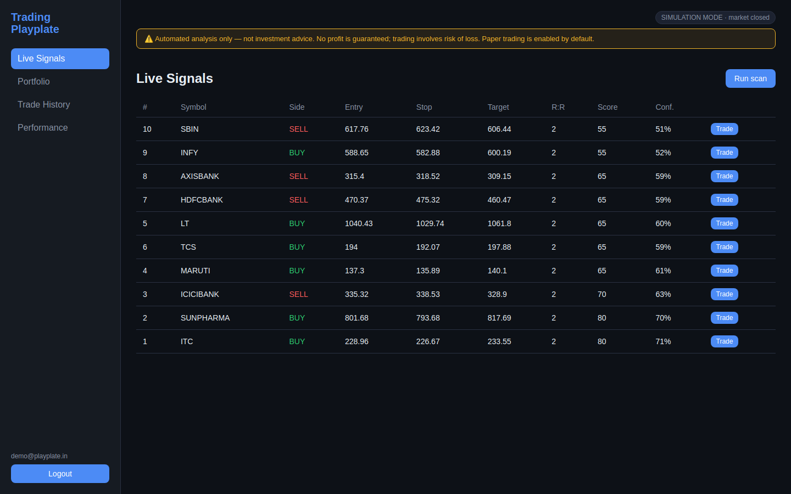
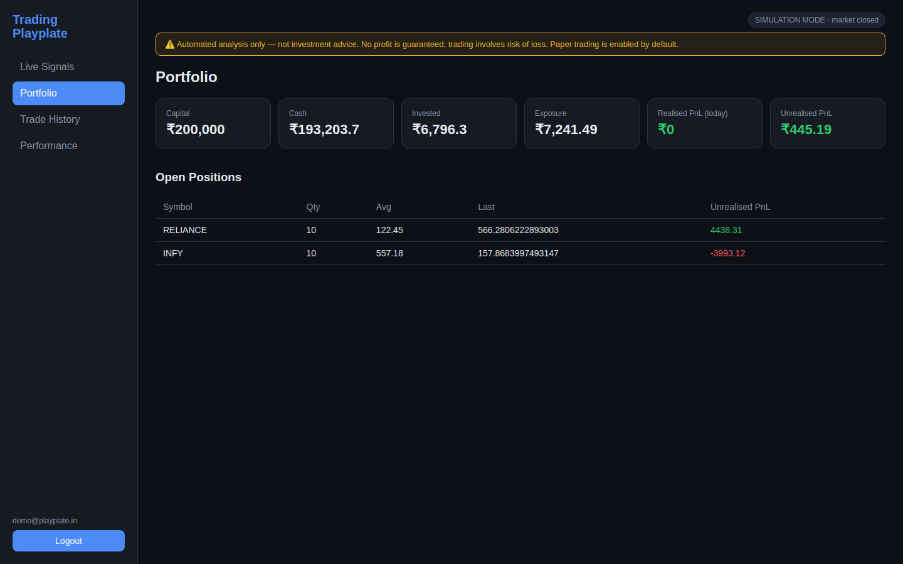
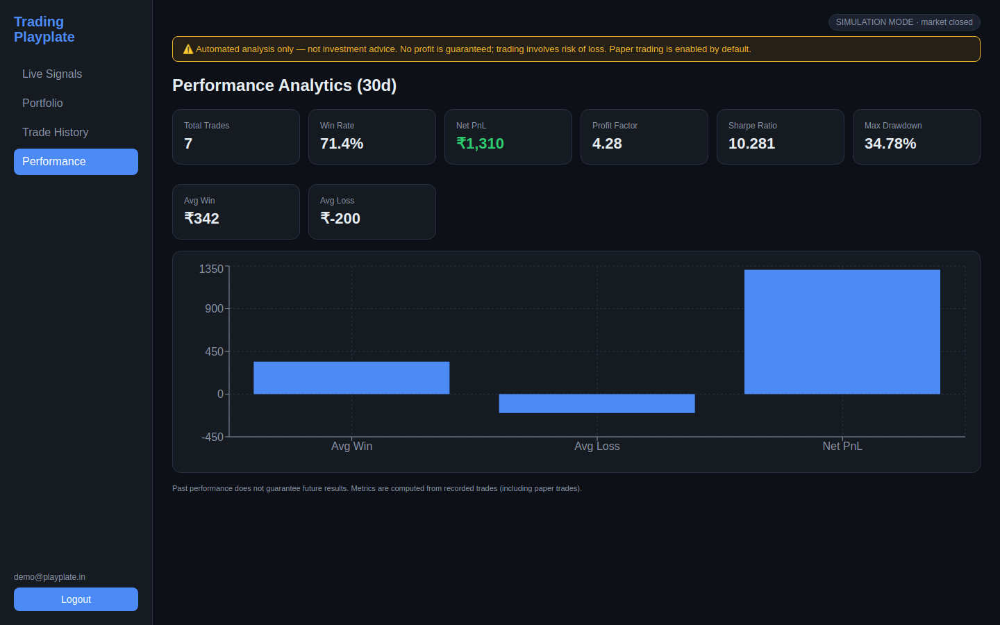
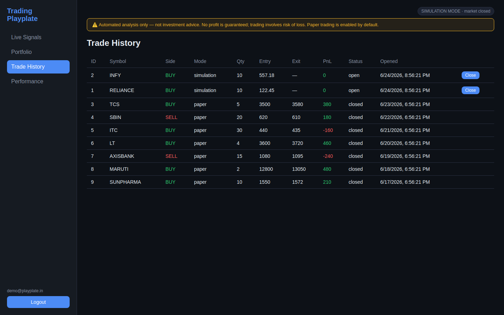

# Trading Playplate

> A production-grade, **safety-first** AI-assisted trading platform for the NSE cash
> segment, integrating Zerodha Kite Connect, a multi-indicator analysis engine, an
> AI signal-ranking/explanation layer, risk management, backtesting, monitoring and
> a React dashboard.

**Domain:** `trading.playplate.in`

---

## ⚠️ Risk Disclaimer (read first)

Trading in securities carries substantial risk of loss and is **not suitable for
every investor**. This software is provided for educational and research purposes.

- **No guarantee of profit.** Nothing in this platform constitutes investment
  advice, a recommendation, or a guarantee of returns. Past performance and
  backtested results do **not** predict future results.
- The platform ships in **paper-trading / simulation mode by default**. Live order
  routing is disabled unless explicitly enabled **and** confirmed per-order.
- You are solely responsible for any orders placed in a live account.
- See [`docs/RISK_DISCLAIMER.md`](docs/RISK_DISCLAIMER.md) for the full disclaimer.

---

## Architecture

```
                                  ┌───────────────────────────────────────────┐
                                  │              trading.playplate.in           │
                                  │            (Let's Encrypt TLS / 443)        │
                                  └───────────────────────┬─────────────────────┘
                                                          │
                                                  ┌───────▼────────┐
                                                  │     Nginx      │
                                                  │ reverse proxy  │
                                                  └───┬───────┬────┘
                                          /api, /ws   │       │  /  (static)
                                         ┌────────────▼─┐  ┌──▼───────────────┐
                                         │   FastAPI    │  │  React (Vite)    │
                                         │   backend    │  │  dashboard SPA   │
                                         │  (uvicorn)   │  └──────────────────┘
                                         └──┬─────┬─────┬──┘
                  ┌───────────────┬─────────┘     │     └──────────┬─────────────────┐
                  │               │               │                │                 │
          ┌───────▼──────┐ ┌──────▼──────┐ ┌──────▼──────┐ ┌───────▼──────┐ ┌────────▼───────┐
          │  Trading     │ │   Risk      │ │   AI layer  │ │   Broker     │ │  Notifications │
          │  engine      │ │  manager    │ │ (Claude API)│ │  abstraction │ │   (Telegram)   │
          │  - scanner   │ │ - sizing    │ │ - ranking   │ │ - Zerodha    │ │  - alerts      │
          │  - indicators│ │ - limits    │ │ - confidence│ │ - paper/sim  │ │  - summaries   │
          │  - MTF       │ │ - breaker   │ │ - NL explain│ │ - sessions   │ └────────────────┘
          └──────┬───────┘ └──────┬──────┘ └──────┬──────┘ └──────┬───────┘
                 │                │               │               │
                 └────────────────┴───────┬───────┴───────────────┘
                                          │
                                  ┌───────▼────────┐        ┌───────────────────────┐
                                  │  PostgreSQL    │        │  Prometheus + Grafana │
                                  │  (+ Alembic)   │◄───────│  metrics / dashboards │
                                  │  signals,trades│        │  health / alerting    │
                                  │  audit log     │        └───────────────────────┘
                                  └────────────────┘
```

See [`docs/ARCHITECTURE.md`](docs/ARCHITECTURE.md) for a component-level breakdown.

---

## Repository layout

```
playplate/
├── README.md
├── docker-compose.yml          # Full stack orchestration
├── docker-compose.monitoring.yml
├── .env.example                # Copy to .env and fill in
├── Makefile                    # Common dev/ops commands
├── backend/                    # FastAPI service
│   ├── app/
│   │   ├── main.py             # App factory / lifespan
│   │   ├── config.py           # Pydantic settings
│   │   ├── database.py         # SQLAlchemy engine/session
│   │   ├── models/             # ORM models
│   │   ├── schemas/            # Pydantic DTOs
│   │   ├── core/               # security, encryption, rate-limit
│   │   ├── broker/             # Zerodha + paper/sim + sessions
│   │   ├── engine/             # indicators, scanner, market hours, MTF
│   │   ├── risk/               # position sizing, limits, circuit breaker
│   │   ├── ai/                 # ranking, confidence, NL explanations, reports
│   │   ├── notifications/      # Telegram bot
│   │   ├── backtest/           # backtesting engine + metrics
│   │   └── api/                # routers
│   ├── alembic/                # migrations
│   ├── tests/
│   ├── requirements.txt
│   └── Dockerfile
├── frontend/                   # React + Vite dashboard
│   ├── src/
│   ├── package.json
│   └── Dockerfile
├── infra/                      # nginx, prometheus, grafana config
├── deploy/                     # VPS + CI/CD scripts
└── docs/                       # setup, deployment, DNS, SSL, testing
```

---

## Screenshots

> Captured from the app running in **simulation mode**. Numbers are synthetic
> and for illustration only — no profit is implied or guaranteed.

| Live Signals | Portfolio |
|---|---|
|  |  |

| Performance Analytics | Trade History |
|---|---|
|  |  |

Try it yourself in one command (no broker needed):

```bash
make demo        # http://localhost:8080  ·  demo@playplate.in / demo-password-123
```

---

## Quick start (local, paper-trading mode)

```bash
cp .env.example .env            # then edit secrets
make build                      # build images
make up                         # start the stack
make migrate                    # apply DB migrations
make seed                       # create the first admin user
open http://localhost:8080      # dashboard (paper mode by default)
```

Full instructions: [`docs/SETUP.md`](docs/SETUP.md).

## Production deployment

- VPS provisioning & deploy: [`docs/VPS_DEPLOYMENT.md`](docs/VPS_DEPLOYMENT.md)
- DNS for `trading.playplate.in`: [`docs/DNS_CONFIGURATION.md`](docs/DNS_CONFIGURATION.md)
- SSL via Let's Encrypt: [`docs/SSL_CONFIGURATION.md`](docs/SSL_CONFIGURATION.md)
- Monitoring (Prometheus/Grafana): [`docs/MONITORING.md`](docs/MONITORING.md)
- Testing checklist: [`docs/TESTING.md`](docs/TESTING.md)

## Operating modes

| Mode        | `TRADING_MODE` | Orders routed to broker?         | Default |
|-------------|----------------|----------------------------------|---------|
| Simulation  | `simulation`   | No — synthetic fills, fake data  | —       |
| Paper       | `paper`        | No — real data, simulated fills  | ✅ yes  |
| Live        | `live`         | **Yes — requires per-order confirm** | —   |

Live mode additionally requires `ALLOW_LIVE_TRADING=true` and an explicit
confirmation token on every order request. See `backend/app/broker/base.py`.
